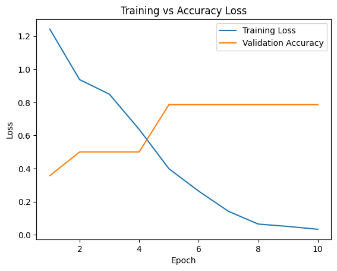

# AI Perf AQA

A simple DistilBERT classifier that predicts benchmark suites from GitHub commit messages.

## Results
Top-1 validation accuracy: ~78%

Previously ran on CMU Deepnet: NVIDIA A100 80GB

## How to Run
1. Clone the repo:
   ```bash
   git clone https://github.com/your-username/ai-perf-aqa.git
   cd ai-perf-aqa
   ```
2. Add your GitHub personal access token in a file named **token.txt**:
    ```bash
    your_github_token_here
    ```
3. Run the notebook:
Open ai_perf_aqa.ipynb in Jupyter or VS Code, and run all cells.
